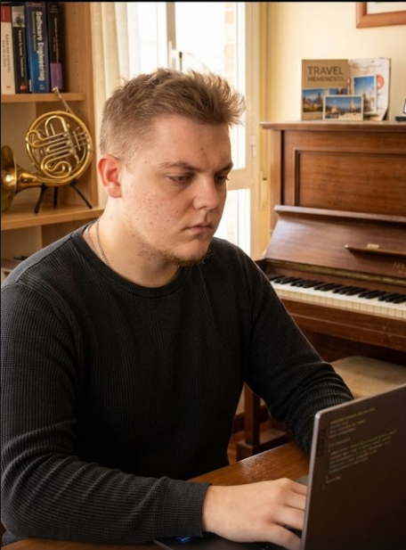

  

  

<h2 align="center">
  

</h2>

---

## <picture></picture> Sobre Mí

* 🎓 Estudiante de **Ingeniería Informática** en la **Universidad de Huelva (UHU)**.
* 📜 Titulado en **Desarrollo de Aplicaciones Multiplataforma (DAM)**.
* 🎶 **Músico Profesional**: La disciplina del conservatorio aplicada al código.
* ✈️ Me apasiona **viajar**, descubrir nuevas culturas y perderme en la **música**.
* 🏋️‍♂️ El **gimnasio** es mi lugar de desconexión y disciplina diaria.

---

## Contribution Snake 

## My Tech Stack and Tools

### Programming Languages

  
  
  
  
  

### Frameworks and Software

  
  
  
  
  

	
## GitHub Stats

| My Stats |
| :---: |
|  |
|  | 
|  | 

  

  

---
### ✍️ Pro Tip de Programador

  

